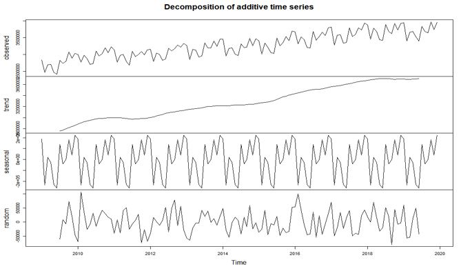
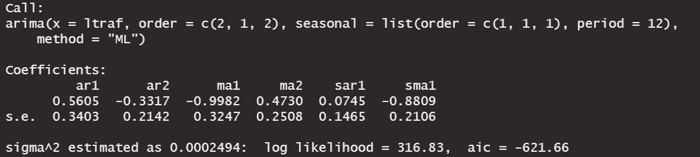
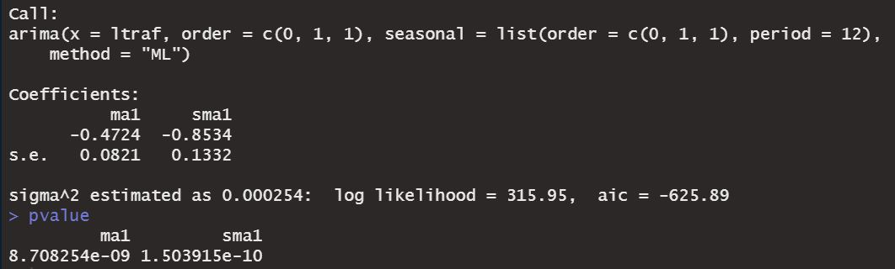
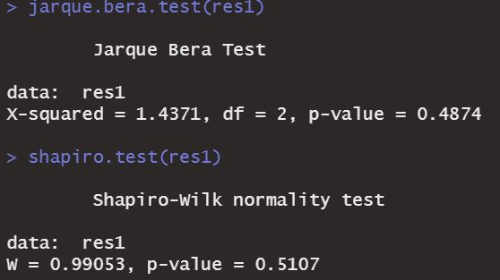
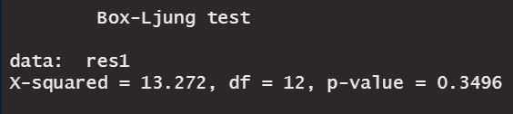
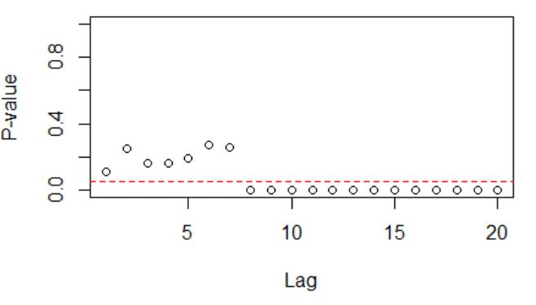
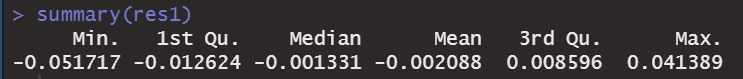
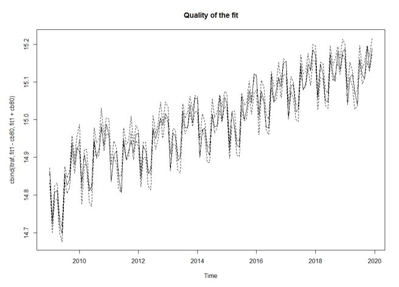
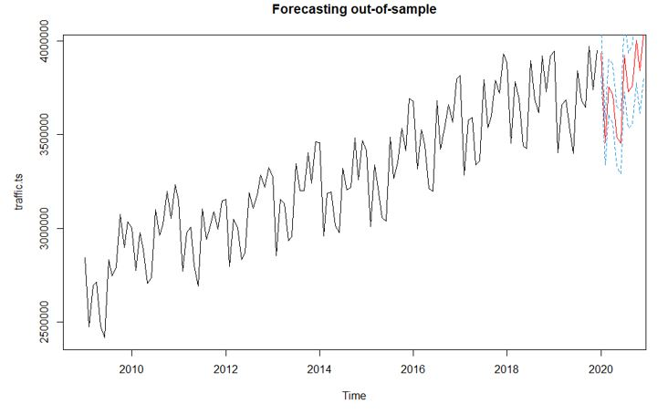
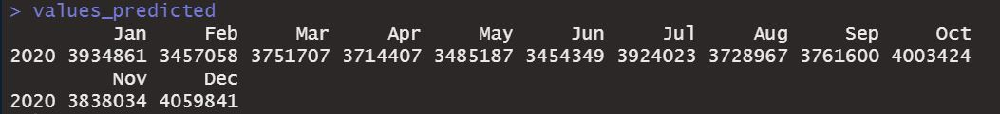

# Predictive Modelling on Time Series with R
## Forecasting on the Sydney Airport Frequentation

Our dataset presents 132 monthly observations of the number of passengers who flew through Sydney airport (from January 2009 to December 2019).
We used this data to predict the number of passengers that would frequent the airport in 2020 (if Covid-19 had not struck).

### Plot of the time series

### Decomposition of the additive time series

We can observe the long increasing trend, the seasonality and the random component that add to the observed frequentation of the airport and that composed the time series. 

### Making the time series stationary 

##### Log tranformation

We firstly performed a log transformation to eliminate the non constant variance

Looking at the ACF & PACF of the time series, there is still no stationarity so we proceeded to a first order difference to eliminate the stochastic trend.

##### First order difference

Ploting the ACF & PACF we see that there still is a seasonality trend on our time series, so it is not yet stationary.

##### Difference of lag 12

We performed a difference of lag 12 to eliminate that seasonality.

### Box-Jenkins methodology

After making our time series we used the Box-Jenkins methodology to find the best fit of our model.

We tried a first arima modelling analyzing the ACF and PACF of the time series. 

We used p = q = 2, and P = Q = d = D = 1

The p-values of coefficients relating to the auto regressive model (ar1, ar2 and sar1) & ma2 are > 5%, so not significant. We remove them and re-estimate the p and q orders to have a more relevant model. 

After choosing p = P = 0 and q = Q = d = D = 1, we obtain a model with only significant coefficients. 

We can also notice that the AIC score has increased, which show that this model is better than the previous one.

Finally we did an analysis of our residuals:

- The Jarque-Bera test and the Shapiro-Wilk test indicate that the residuals follow a normal distribution because the p-value is greater than 0.05

- The Box-Ljung test indicates that the residuals can be approximated to a white noise process, so there is no autocorrelation 

- The McLeod-Li test shows on the plot some elements with p-values higher than 0.05, so the hypothesis of homoscedasticity is verified

- The mean of the residuals can be approximated to zero (because it remains between -2 and +2), then the forecasts are not biased

### Fit of our model

The quality of our model's fit seems rather good with a  proportion of points in the confidence interval of 82.58%. 

### Forescasting of the airport frequentation for 2020

In red are the forecasted values, with in blue the lines of the confidence interval. 

